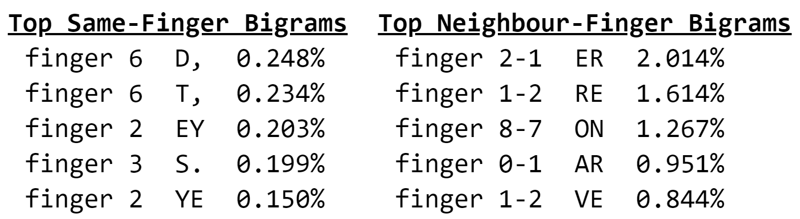

# Koshak layout

*By Roman Koshchey, August 26, 2021*

## Analyzes

Below are the average percentages for each hand. QWERTY has about a 4% lean towards the left while Colemak leans to
the right by about 5%, and Dvorak, 7%. **Koshak balances the
load between the left and right hands near 50%.**

## Compare
- Alice in wonderland

- Common SAT words

- Common words

## Downloads
- [Windows](download/koshak-windows.zip)
- [Mac](download/koshak-mac.zip)
- [Linux](download/koshak-linux.zip)

## I am grateful to
- ze_or#1616 and Boo#4686, they gave good advice
- [Alt Keyboard Layout](https://discord.gg/7rQp5ptF) discord server
- Workman layout, it interested me in creating my own layout

## Advocate
- [Instagram](https://www.instagram.com/koshcher_sw/) and [Youtube](https://www.youtube.com/channel/UC76gVI16vbdC1Bwa87bECyw)
- Share your Koshak experience in forums and social networks.
- Post a video about Koshak.
