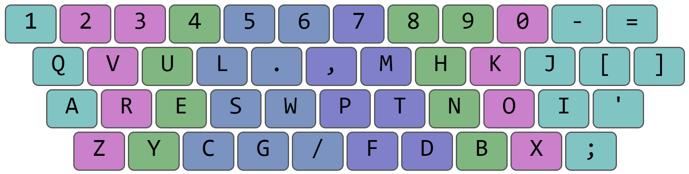

# Koshak layout

*By Roman Koshchey, August 26, 2021*

## Why balance?

Below are the average percentages for each hand. QWERTY has about a 4% lean towards the left while Colemak leans to
the right by about 5%, and Dvorak, 7%. **Koshak balances the
load between the left and right hands near 50% (leans to
the right by only 1.5%).**

## Why speed?
Speed is about typing efficiency. You can see it in comparison with other layouts. 

- Alice in wonderland

- Common SAT words

- Common words

## Detailed analyzes

- Heat map

- Finger bigram frequency

- Top bigrams

- Finger effort

- Finger usage

## Downloads
- [Windows](download/koshak-windows.zip)
- [Mac](download/koshak-mac.zip)
- [Linux](download/koshak-linux.zip)

## I am grateful to
- ze_or#1616 and Boo#4686, they gave good advice
- [Alt Keyboard Layout](https://discord.gg/7rQp5ptF) discord server
- Workman layout, it interested me in creating my own layout

## Advocate
- [Instagram](https://www.instagram.com/koshcher_sw/) and [Youtube](https://www.youtube.com/channel/UC76gVI16vbdC1Bwa87bECyw)
- Share your Koshak experience in forums and social networks.
- Post a video about Koshak.
